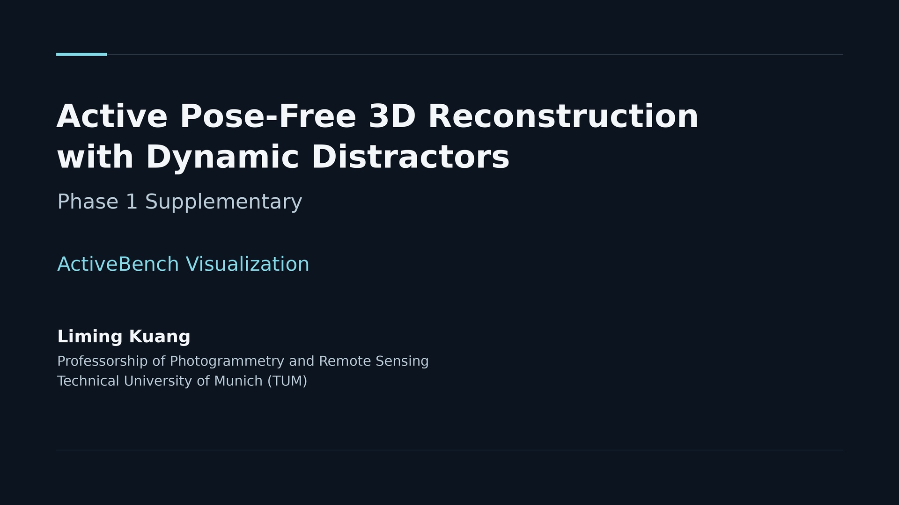

# ActiveBench

An extensible benchmark platform for **active 3D reconstruction under dynamic
distractors**. Run camera-acquisition policies on installed Habitat/MP3D or
InteriorGS scenes, collect comparable RGB-D streams, and evaluate them with a
shared 3D Gaussian reconstruction and held-out reference views.

The repository includes adapters for **R3-RECON, MAGICIAN, FisherRF, GAVIS and
GLEAM**, plus Random. Add another scene through an episode YAML and another
method through a Python factory; neither needs to belong to an existing campaign.
Phase 1 results are retained as a documented reference experiment.

## Start here

| Goal | Guide |
|---|---|
| Install the simulator, evaluator and existing methods | [Setup](docs/SETUP.md) |
| Run one scene/method or a complete benchmark matrix | [Run a benchmark](docs/RUNNING.md) |
| Use other scenes from the datasets | [Datasets and scenes](docs/SCENES.md) |
| Connect a new method through the API/RPC | [Add a method](docs/adding-a-method.md) |
| Understand evaluation cameras, PSNR and dynamic impact | [Protocol](docs/PROTOCOL.md) · [Architecture](docs/ARCHITECTURE.md) |
| Reproduce the supplied report | [Phase 1 results](docs/REPRODUCING.md) |
| View the six scenes and MP3D static/dynamic comparison | [Supplementary video](#supplementary-video) |

## Run the platform

After setup, the workflow is:

```text
installed scene → episode configs → clean references → selected methods → scores/replay
```

[The short tutorial](docs/RUNNING.md#a-short-real-end-to-end-run) runs real
simulation, common reconstruction and evaluation. It does not require Phase 1
model/result archives. Once configs and references are prepared, run a single
method or all five published adapters plus Random:

```bash
python scripts/run_campaign.py \
  --configs-dir outputs/my-study/configs --assets-dir outputs/my-study/assets \
  --methods random r3con-pano magician fisherrf gavis gleam \
  --out-dir outputs/my-study/runs --execute

python scripts/summarize_benchmark.py --runs-dir outputs/my-study/runs
```

Omit `--execute` for a plan. Select `--scenes`, `--conditions`, `--seeds` and
`--methods` independently. Use `--acquisition-only` to collect without training.
The defaults use a 300 s generated episode, a 1 Hz stream and a common 30,000-step
gsplat reconstruction; use the documented short recipe to check installation first.
GLEAM's existing adaptation has been benchmarked on GS scenes; extensions to
other datasets require validation.

For a new method, provide `info()`, `reset(seed, task)` and `act(observation)`.
The launcher accepts `package.module:factory` or `/path/agent.py:factory` and can
run it in its own environment. An [executable example](examples/methods/spin_agent.py)
and [integration tutorial](docs/adding-a-method.md) are included.

## What is versioned

- `src/activebench/`: simulator interface, episode clock, policy API/RPC,
  acquisition, common reconstruction, metrics and replay.
- `scripts/`: scene/reference preparation, campaign execution, fresh summaries,
  environment setup/checking and Spark visualization.
- `configs/`, `examples/`, `tests/`: dataset discovery, method recipes, extension
  examples and interface/protocol checks.
- `phase1/`: the Phase 1 campaign, retained evidence, dependency snapshots
  and table/model verification tools.

Datasets, checkpoints, acquired frames and trained models stay outside Git.
[Hardware/software versions](docs/SYSTEM.md), [executed validation and limits](docs/ACCEPTANCE.md)
and [research/delivery alignment](docs/SOURCE_SYNC.md) are recorded in the repository.

## Phase 1 results

The reference experiment retains 60 reconstructions from 64 planned cells:
four mesh scenes and two InteriorGS scenes, with separate protocols. Its exact
budgets and exceptions remain in [phase1/campaign.json](phase1/campaign.json).
[The reproduction guide](docs/REPRODUCING.md) separates table verification,
saved-model re-scoring and fresh reruns of that experiment.

```bash
# Verify saved evidence/table consistency; this does not execute a benchmark.
python scripts/phase1/report.py --check
```

The general platform workflow above produces new results independently of these
frozen tables. The GitHub repository is named `activerecon-phase1`; the benchmark
package and API remain `activebench`.

## Supplementary video

**ActiveBench Visualization · 4:54** — six static scenes, followed by a
five-method MP3D static/dynamic comparison. Click the cover to open the downloads.

[](https://github.com/StevenKuang/activerecon-phase1/releases/tag/phase1-videos)

[Download 1080p · 287 MB](https://github.com/StevenKuang/activerecon-phase1/releases/download/phase1-videos/ActiveBench-Phase1-All-Scenes-1080p.mp4)
· [Download 4K · 1.09 GB](https://github.com/StevenKuang/activerecon-phase1/releases/download/phase1-videos/ActiveBench-Phase1-All-Scenes-4K.mp4)
· [Chapters and visualization guide](docs/VIDEO.md)

The complete MP4s are Release attachments, so cloning the code stays small.
Sign in with repository access to download them, then open them in a video player.
`phase1-videos` identifies the media collection; use `main` for the platform code.
